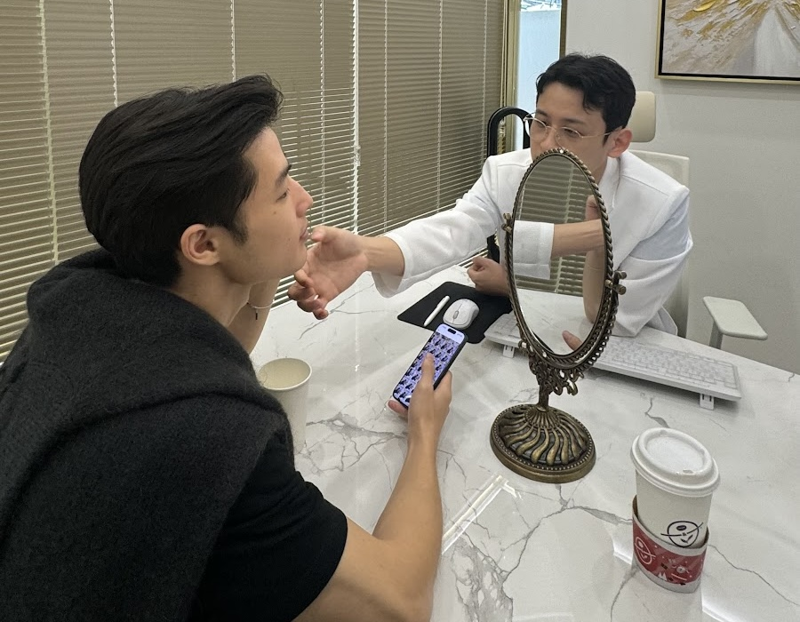

# Preface

<figure><figcaption>
Founder of Vera, catching up with his K-beauty scientist friend in Seoul (2024)
</figcaption></figure>

<em>“The desire to align how we look with how we feel is one of life’s quiet, persistent currents. It’s not about vanity, but about integrity – the state of being whole and undivided.”</em>

There is a great gulf today between beauty and technology. Yet, the urge to refine, reclaim, or enhance our appearance is not going away. In fact, it’s accelerating. The science is real. The infrastructure is not. Therein lies a gap.

Aesthetic treatment decisions are increasingly global, personal, and inevitable, yet many people are navigating them in the dark. We felt this problem deeply – not just for ourselves, but for our friends. Then, in Seoul, we saw the future. And we decided to build it. And so we started Vera.

Vera isn’t just another startup. It is a system that is being designed to help people decide how much control they want over the things that make them feel most vulnerable. Vera is more than an educational guide. It is a trust engine and a clarity machine. It is a system that can’t afford to lie to itself because trust is the product.

We imagine Vera as a massive knowledge-transfer machine. One that earns people’s trust at the exact moment they need it most. A middleman that actually makes life better.

_Books by Vera_ — the series this book begins — is an extension of three things:

1. Our love of education
2. Our commitment to community
3. Our belief in the global adoption of advanced aesthetic care

These books will span every topic in aesthetic medicine — educational, inspiring, and transparent — for both providers and consumers alike.

This first book, _Raising the World’s Skin Game_, is for those who have entered a richer, more complex chapter of their life. You have built a career, a home, a world—and now you wish to turn that same thoughtful attention inward:

* It is for those not looking to erase your story, but to ensure that the face you show the world every day feels as vital and self-aware as you are.
* It is for anyone who has realized that skincare products, diet, or sleep alone aren’t enough to get the results they want
* It is for anyone who may be feeling lost or overwhelmed by the complex world of aesthetic treatments and unsure where to begin

This book is organized into three sections: culture, science, and vision. We begin in Seoul, where the K-beauty wave has become a cultural force. Then we explore what is scientifically possible in aesthetic medicine. Finally, we share Vera’s philosophy and what raising the world’s skin game for the next 100 years will require.

Whether or not you care about Vera’s story, we invite you to learn with us. The journey toward clarity — for your face, your body, and your desires — might just exceed your expectations.

⁂

